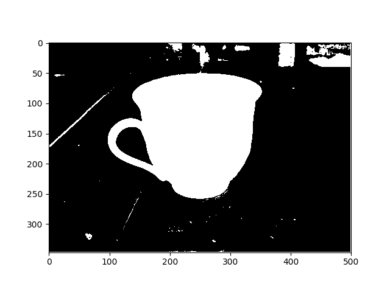

# TV_Segmentation

This is an implement of ```binary image segmentation based on total variation```. For algorithm details, please see in [here](https://github.com/jfzhang95/TV_Segmentation/blob/master/notes.pdf).

### Dependencies
```
Python3.x (Tested with 3.5)
opencv
PyQt4
scikit-learn
```

### Installation
To use this code, please do:


0. Clone the repo:
    ```Shell
    git https://github.com/jfzhang95/TV_Segmentation
    cd TV_Segmentation
    ```
1. Install dependencies:
    ```Shell
    pip install opencv matplotlib scikit-learn pyqt4
    ```

2. To try the demo code, please run:
    ```Shell
    python demo.py
    ```

If installed correctly, the result should look like this:


### Usage
Note that in demo.py, we only use very siple unary term. More advanced unary term is implemented in [GraphMaker.py](https://github.com/jfzhang95/TV_Segmentation/blob/master/GraphMaker.py) and [GraphMaker_kmeans.py](https://github.com/jfzhang95/TV_Segmentation/blob/master/GraphMaker_kmeans.py), they need user input to build prior knowledge. [CutUI.py](https://github.com/jfzhang95/TV_Segmentation/blob/master/CutUI.py) is a GUI implemented for User Interactivation.

The primal dual total variation optimization method is implemented in [utils.py](https://github.com/jfzhang95/TV_Segmentation/blob/master/utils.py)

### License
[MIT](https://github.com/jfzhang95/TV_Segmentation/blob/master/LICENSE)

